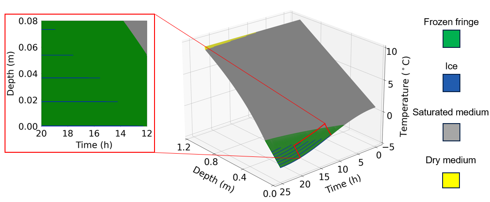
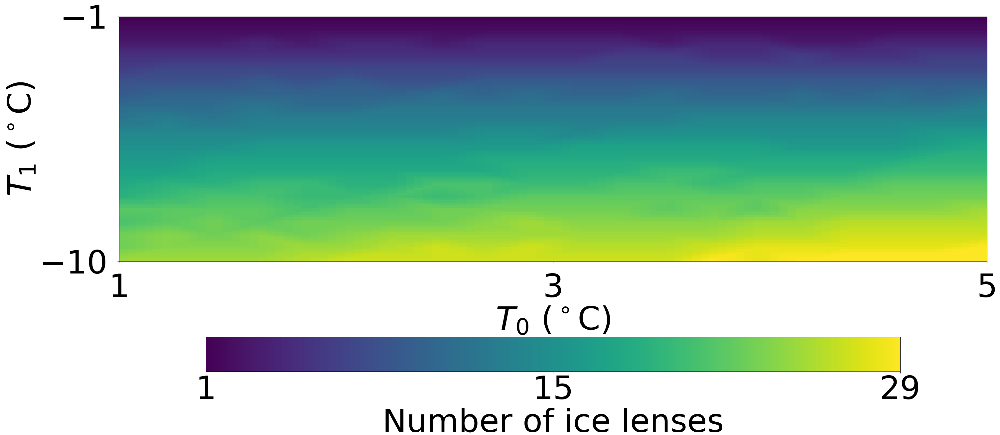

# Ice lens model

## Introduction

This is a repository for a 1D numerical model to predict ice lensing phenomenon in an initially saturated sandstone wall under different climatic conditions (monotonic and cyclic). The following steps for preparation of input files, compilation of source codes and running simulations all take the monotonic case for instance and the cyclic case is similar.

## Prepare input files

The input file of the simulation (.inp) is contained in a folder named example in the repository. The physical meanings of all the model parameters have been given in the file. You can re-name the file as you wish and modify the parameters accordingly.


## Compilation of source codes

The CmakeLists files have been well prepared. To compile, you need to have cmake with a version 3.1 at least. First, create a build folder in the repository (i.e., ice_model_project_monotonic) and type the following commands in the terminal:

```
cd build
cmake ..
```

Switch on the example option and press configure ([c]) until generate ([g]) appears at the bottom. Finally, press g to generate cmake files. In the terminal, type

```
make
```

## Run a simulation

In the build folder, you will find a subfolder also named example, to which the input file has been copied and pasted. To run a simulation, type the following commands in the terminal:

```
cd example
./example <input_file_path> <output_path>
```

Here, the executable is named as example, but it could be modified from the CmakeLists file in the example folder in the repository (not in the build folder). Note that the input file and output paths are relative paths to the current working directory.

## Post-process output results

The post-processing of the results could be done by running two files as follows depending on your Python version:

```
python3 2dplot.py
python3 3dplot.py
```

The paths to read the data should be modified according to your location of dumping the results. The two files will produce plots as below




Sensitivity analysis is conducted in the folder named senstivity_analysis for four material parameters including porosity, cohesion, permeability at saturation, and characteristic pore size. The executable (example) should first be copied to this folder from ice_model_project_monotonic/build/example. The senstivity analysis is completed with UQ[py]Lab, a Python package developed by the Chair of Risk, Safety and Uncertainty Quantification (RSUQ) at ETHz, and it is better to install it in a clean virtual environment (e.g., set up with conda) following the instructions here: https://uqpylab.uq-cloud.io/getting-started. Then, activate the virtual environment and run ice_lens_results.py as follows, which gets the samples in the given parametric space and run the simulations:

```
conda activate <name_of_virtual_environment>
python3 ice_lens_results.py
```

The variable wd in ice_lens_results.py, which indicates the current working directory, should be modified accordingly. UQ[py]Lab is then used to evaluate the total Sobol' indices of the parameters on two model responses (i.e., total ice lens thickness and number of ice lenses) by:

```
python3 sen_ana.py
```

Typical results for senstivity analysis look like:


Note that the Sobol' index is calculated from Polynomial Chaos Expansion (PCE) as a metamodel of the original model. Thus, PCE needs to be validated by the histograms or Y-Y plots of true model responses and PCE predictions, which can also be done in sen_ana.py.

Furthermore, the effects of boundary conditions (i.e., initial and minimum temperatures at the cooler side) on the ice lensing phenomenon are investigated in the folder periodicity_ana. Similarly, all the simulations are run with ice_lens_results.py first and then a color map could be obtained as follows, indicating the boundary conditions that trigger periodic ice lensing:



## Run a simulation

In the build folder, you will find a subfolder also named example, to which the input file has been copied and pasted. To run a simulation, type the following commands in the terminal:

```
cd example
./example <input_file_path> <output_path>
```

Here, the executable is named as example, but it could be modified from the CmakeLists file in the example folder in the repository (not in the build folder). Note that the input file and output paths are relative paths to the current working directory.

## Post-process output results

The post-processing of the results could be done by running two files as follows depending on your Python version:

```
python3 2dplot.py
python3 3dplot.py
```

The paths to read the data in the two scripts above should be modified according to your location of dumping the results. The two files will produce plots as below


Sensitivity analysis is conducted in the folder named senstivity_analysis for four material parameters including porosity, cohesion, permeability at saturation, and characteristic pore size. The executable (example) should first be copied to this folder from ice_model_project_monotonic/build/example. The senstivity analysis is completed with UQ[py]Lab, a Python package developed by the Chair of Risk, Safety and Uncertainty Quantification (RSUQ) at ETHz, and it is better to install it in a clean virtual environment (e.g., set up with conda) following the instructions here: https://uqpylab.uq-cloud.io/getting-started. Then, activate the virtual environment and run ice_lens_results.py as follows, which gets the samples in the given parametric space and run the simulations:

```
conda activate <name_of_virtual_environment>
python3 ice_lens_results.py
```

UQ[py]Lab is then used to evaluate the total Sobol' indices of the parameters on two model responses (i.e., total ice lens thickness and number of ice lenses) by:

```
python3 sen_ana.py
```

Typical results for senstivity analysis look like:


Note that the Sobol' index is calculated from Polynomial Chaos Expansion (PCE) as a metamodel of the original model. Thus, PCE needs to be validated by the histograms or Y-Y plots of true model responses and PCE predictions, which can also be done in sen_ana.py.

Furthermore, the effects of boundary conditions (i.e., initial and minimum temperatures at the cooler side) on the ice lensing phenomenon are investigated in the folder periodicity_ana. Similarly, all the simulations are run by ice_lens_results.py and then a color map could be obtained from N_ana.py as follows, indicating the boundary conditions that trigger periodic ice lensing:


