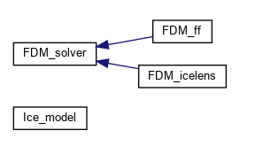

Developer's Guide
=================
Code architecture
-----------------

The central class is the  :cpp:class:`Ice_model` class. It contains

- the node information, namely coordinates of nodes,
  
- the boundary conditions, i.e., temperatures applied at two ends of the struture,

- the initial condition,

- the real-time temperature profile including information for frozen fringe boundary, 0 degree Celsius isotherm and freezing rate,

- information for ice lenses including their growth rates and position of formation,

- the finite difference solver to solve the system.

The finite difference solver  :cpp:class:`FDM_solver` has two child classes, which are
the solver for the case without any phase change :cpp:class:`FDM_without_s` and the one for the case with ice lens formation :cpp:class:`FDM_icelens_without_s`.

The key classes for the library `ice_model` are schematically described:

Ice_model
'''''''''

The :cpp:class:`Ice_model` is the central class of the library.
It is used to manage the model structure. It contains

- the node information, namely coordinates of nodes,
  
- the boundary conditions, i.e., temperatures applied at two ends of the struture,

- the initial condition,

- the real-time temperature profile including information for frozen fringe boundary, 0 degree Celsius isotherm and freezing rate,

- information for ice lenses including their growth rates and position of formation,

- the finite difference solver to solve the system.

.. doxygenclass:: Ice_model
   :members:
   :protected-members:
   :allow-dot-graphs:

FDM Solver
''''''''''

The :cpp:class:`FDM_solver` is a parent class of two solver classes implemented in the library, which are intended for differents cases (i.e, with only frozen fringe and with ice lens formation),
respectively. The base class, however, is just used for the simplest case where there is no phase change.

.. doxygenclass:: FDM_solver
   :members:
   :protected-members:
   :allow-dot-graphs:

Solver for no ice lens but with frozen fringe
'''''''''''''''''''''''''''''''''''''''''''''
The :cpp:class:`FDM_ff` is the solver intended for the case with frozen fringe in the porous medium but without any ice lens formed.

.. doxygenclass:: FDM_ff
   :members:
   :protected-members:
   :allow-dot-graphs:

Solver for ice lens formation
'''''''''''''''''''''''''''''
The :cpp:class:`FDM_icelens` is a derived class of :cpp:class:`FDM_solver` which is used when there is ice lens formed in the porous medium.

.. doxygenclass:: FDM_icelens
   :members:
   :protected-members:
   :allow-dot-graphs:

Coding conventions
------------------

We adopt the following coding conventions:

**Comment**: briefly describe code and algorithms

**Indent style**: `Stroustrup <https://en.wikipedia.org/wiki/Indentation_style#K&R_style>`_ with 1 space tab

**Naming**:

- all methods begin with a verb or noun

- all class names are UpperCamelCase

- all members are `snake_case <https://en.wikipedia.org/wiki/Snake_case>`_
